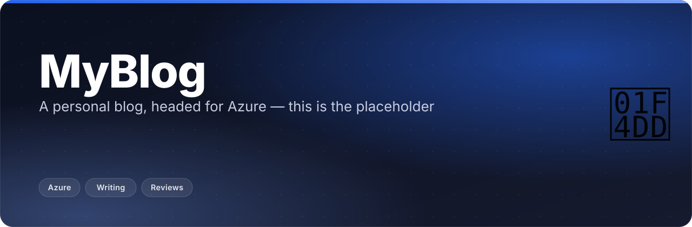

<p align="center"></p>

<p align="center">
  <b>My personal blog — it will get deployed onto Azure and host my cool reviews. This repo is the placeholder before that build starts.</b>
</p>

<p align="center">
  
  
</p>

## ✨ What this is

- A personal blog for reviews and writing, intended to deploy on **Azure**.
- No app exists here yet — this repo currently holds nothing but this README.
- Until the Azure build lands, active writing lives in the studio site linked below.

## 🧭 Status

| | |
|---|---|
| **Stage** | 🚧 Placeholder — no code, no deployment yet |
| **What exists** | This README |
| **What's next** | An Azure-hosted blog for reviews and writing |

No fake roadmap beyond that: there is no build timeline yet, just the intent stated in the repo description.

## ✍️ Where the writing actually is today

While this repo is empty, current writing lives on the studio site:

**[Exaryn Studio notes](https://chinmaygit8765.github.io/exaryn-studio/)**
<br><sub>Where notes and writing currently live, ahead of this blog's own deployment.</sub>

## 🗂️ Project layout

```
MyBlog/
├── README.md          ← you are here
└── docs/assets/        images used by this README
```

<p align="center"><sub>Built by <a href="https://github.com/ChinmayGit8765">Chinmay</a> · part of the <a href="https://chinmaygit8765.github.io/exaryn-studio/">Exaryn</a> studio</sub></p>
